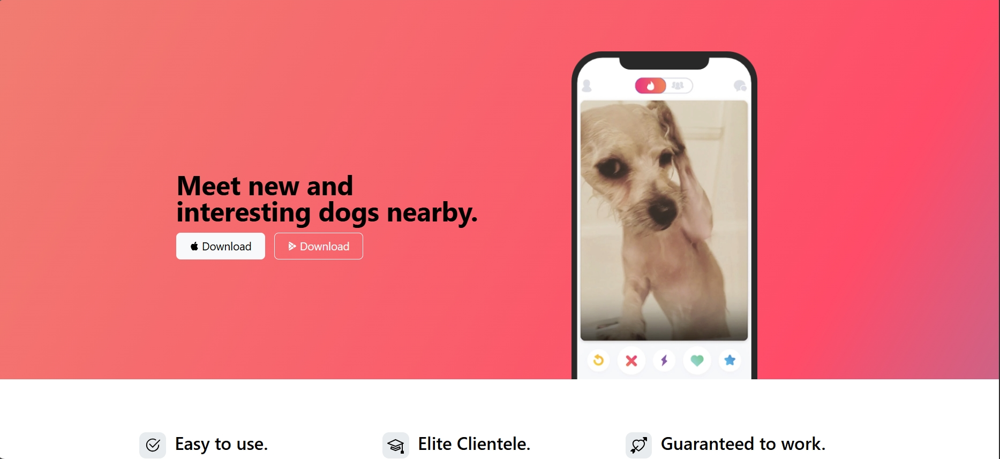

# Tin_Dog_Bootstrap_Project

TinDog is a modern, responsive landing page built with **Bootstrap 5**. The project showcases a fictional dog dating app designed to connect dog lovers with new and interesting dogs nearby. It features a sleek UI, mobile responsiveness, and multiple sections like features, testimonials, and pricing plans.

---

## Table of Contents

- [Demo](#demo)
- [Features](#features)
- [Technologies Used](#technologies-used)
- [Setup](#setup)
- [Usage](#usage)
- [Credits](#credits)
- [License](#license)

---

### 🏠 Home Page

---

## Features

- Responsive design using Bootstrap grid and utilities.
- Attractive hero section with app screenshot.
- Feature highlights with icons.
- Testimonial section with user quote and logos.
- Pricing plans tailored for different dog breeds.
- Download buttons with SVG icons for App Store and Google Play.

---

## Technologies Used

- HTML5
- CSS3
- [Bootstrap 5](https://getbootstrap.com/)
- SVG icons (Bootstrap Icons)
- Responsive images and layout

---

## 🙋‍♀️ Author

Made with ❤️ by **Yogeshwari**

* 💼 [GitHub](https://github.com/Yogeshwari1703)

---
